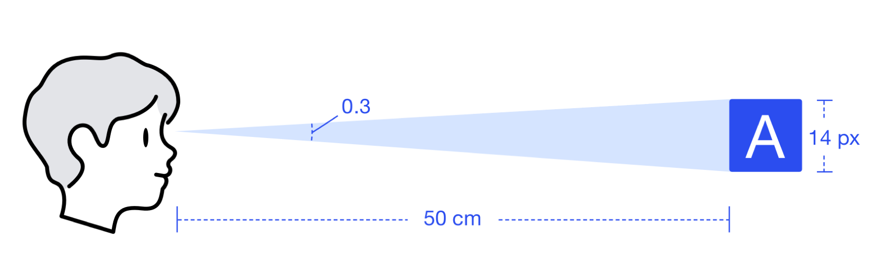

<script>
  import bus from '../../bus';
  import { ACTION_USER_CONFIG_UPDATE } from '../../components/theme/constant.js';
  const varMap = [
    '$--font-size-extra-large',
    '$--font-size-large',
    '$--font-size-medium',
    '$--font-size-base',
    '$--font-size-small',
    '$--font-size-extra-small'
  ];
  const original = {
    'font_size_extra_large': '20px',
    'font_size_large': '18px',
    'font_size_medium': '16px',
    'font_size_base': '14px',
    'font_size_small': '13px',
    'font_size_extra_small': '12px'
  }
  export default {
    created() {
      bus.$on(ACTION_USER_CONFIG_UPDATE, this.setGlobal);
    },
    mounted() {
      this.setGlobal();
    },
    methods: {
      tintColor(color, tint) {
        return tintColor(color, tint);
      },
      setGlobal() {
        if (window.userThemeConfig) {
          this.global = window.userThemeConfig.global;
        }
      }
    },
    data() {
      return {
        global: {},
        'font_size_extra_large': '',
        'font_size_large': '',
        'font_size_medium': '',
        'font_size_base': '',
        'font_size_small': '',
        'font_size_extra_small': '',
        fontType:{
          main_title:   'font-size:20px;line-height:28px;font-weight:700;color:#464c5b;',
          two_title:    'font-size:18px;line-height:26px;font-weight:700;color:#464c5b;',
          three_title:  'font-size:16px;line-height:24px;font-weight:700;color:#464c5b;',
          little_title: 'font-size:14px;line-height:22px;font-weight:700;color:#464c5b;',

          main_text:    'font-size:14px;line-height:22px;color:#657180;',
          extra_text:   'font-size:14px;line-height:22px;color:#9ea7b4;',
          disable_text: 'font-size:14px;line-height:22px;color:#c3cbd6;',
          link_text:    'font-size:14px;line-height:22px;color:#f5c319;',
        }
      }
    },
    watch: {
      global: {
        immediate: true,
        handler(value) {
          varMap.forEach((v) => {
            const key = v.replace('$--', '').replace(/-/g, '_')
            if (value[v]) {
              this[key] = value[v]
            } else {
              this[key] = original[key]
            }
          });
        }
      }
    },
  }
</script>

## Typography 字体

字体是体系化界面设计中最基本的构成之一。

科学的字体系统将大大提升用户的阅读体验及工作效率。基于「动态秩序」的设计原则，结合了自然对数以及音律的规则得出的，在视觉体系中定义字体系统，主要从下面五个方面出发：

1、字体家族

2、主字体

3、字阶与行高

4、字重

5、字体使用规范


### 字体家族
<div class="demo-term-box">


</div>

优秀的字体系统首先是要选择合适的字体家族。字体家族中优先使用系统默认的界面字体，同时提供了一套利于屏显的备用字体库，来维护在不同平台以及浏览器的显示下，字体始终保持良好的易读性和可读性，体现了友好、稳定和专业的特性。


```css

font-family: "Helvetica Neue",Helvetica,"PingFang SC","Hiragino Sans GB","Microsoft YaHei","微软雅黑",Arial,sans-serif;

```

### 主题字

基于电脑显示器阅读距离（50 cm）以及最佳阅读角度（0.3，主字体设置为 14，以保证在多数常用显示器上的用户阅读效率最佳。

<div class="demo-term-box-one">
  
</div>


### 字阶与行高

字阶和行高决定着一套字体系统的动态与秩序之美。字阶是指一系列有规律的不同尺寸的字体。行高可以理解为一个包裹在字体外面的无形的盒子。

<div class="demo-term-box-one">
  
</div>

本系统定义了 10 个不同尺寸的字体以及与之相对应的行高。严格按照尺寸设置，字体和行高必须对应。

<div class="demo-term-box-one">
  
</div>

<table class="demo-typo-size">
  <tbody>
  <tr
    >
      <td>层级</td>
      <td>字体大小</td>
      <td class="color-dark-light">举例</td>
    </tr>
    <tr
    :style="{ fontSize: font_size_extra_small }"
    >
      <td>辅助文字</td>
      <td class="color-dark-light">{{font_size_extra_small}} Extra Small</td>
      <td>用 Coduck 快速搭建页面</td>
    </tr>
    <tr
    :style="{ fontSize: font_size_base }"
    >
      <td>正文</td>
      <td class="color-dark-light">{{font_size_base}} Base</td>
      <td>用 Coduck 快速搭建页面</td>
    </tr>
    <tr
    :style="{ fontSize: font_size_medium }"
    >
      <td>小标题</td>
      <td class="color-dark-light">{{font_size_medium}} Medium</td>
      <td>用 Coduck 快速搭建页面</td>
    </tr>
    <tr
    :style="{ fontSize: font_size_large }"
    >
      <td>标题</td>
      <td class="color-dark-light">{{font_size_large}} large</td>
      <td>用 Coduck 快速搭建页面</td>
    </tr>
    <tr
    :style="{ fontSize: font_size_extra_large }"
    >
      <td>主标题</td>
      <td class="color-dark-light">{{font_size_extra_large}} Extra large</td>
      <td>用 Coduck 快速搭建页面</td>
    </tr>
  </tbody>
</table>

### 字重

字重的选择同样基于秩序、稳定、克制的原则。多数情况下，只出现 regular 以及 medium 的两种字体重量，分别对应代码中的 400 和 500。在英文字体加粗的情况下会采用 semibold 的字体重量，对应代码中的 600。

<div class="demo-term-box">


</div>

### 字体使用规范

<table class="demo-typo-size">
  <tbody>
    <tr>
      <td>中文字体</td> <td>实例</td><td>字号</td><td>行高</td><td>粗细</td><td>颜色</td><td>样式</td>
    </tr>
    <tr>
      <td :style="fontType.main_title">主标题</td><td :style="fontType.main_title">我是标题</td><td>20px</td><td>28px</td><td>700</td><td>#464c5b</td><td>{{fontType.main_title}}</td>
    </tr>
    <tr>
      <td :style="fontType.two_title">次级标题</td><td :style="fontType.two_title">我是标题</td><td>18px</td><td>26px</td><td>700</td><td>#464c5b</td><td>{{fontType.two_title}}</td>
    </tr>
    <tr>
      <td :style="fontType.three_title">三级标题</td><td :style="fontType.three_title">我是标题</td><td>16px</td><td>24px</td><td>700</td><td>#464c5b</td><td>{{fontType.three_title}}</td>
    </tr>
    <tr>
      <td :style="fontType.little_title">小标题</td><td :style="fontType.little_title">我是标题</td><td>14px</td><td>22px</td><td>700</td><td>#464c5b</td><td>{{fontType.little_title}}</td>
    </tr>
    <tr>
      <td :style="fontType.main_text">正文</td><td :style="fontType.main_text">我是标题</td><td>14px</td><td>22px</td><td>默认</td><td>#657180</td><td>{{fontType.main_text}}</td>
    </tr>
    <tr>
      <td :style="fontType.extra_text">辅助文字</td><td :style="fontType.extra_text">辅助文字</td><td>14px</td><td>22px</td><td>默认</td><td>#9ea7b4</td><td>{{fontType.extra_text}}</td>
    </tr>
    <tr>
      <td :style="fontType.disable_text">失效文字</td><td :style="fontType.disable_text">失效文字</td><td>14px</td><td>22px</td><td>默认</td><td>#c3cbd6</td><td>{{fontType.disable_text}}</td>
    </tr>
    <tr>
      <td :style="fontType.link_text">连接文字</td><td :style="fontType.link_text">连接文字</td><td>14px</td><td>22px</td><td>默认</td><td>#f5c319</td><td>{{fontType.link_text}}</td>
    </tr>
  </tbody>
</table>

